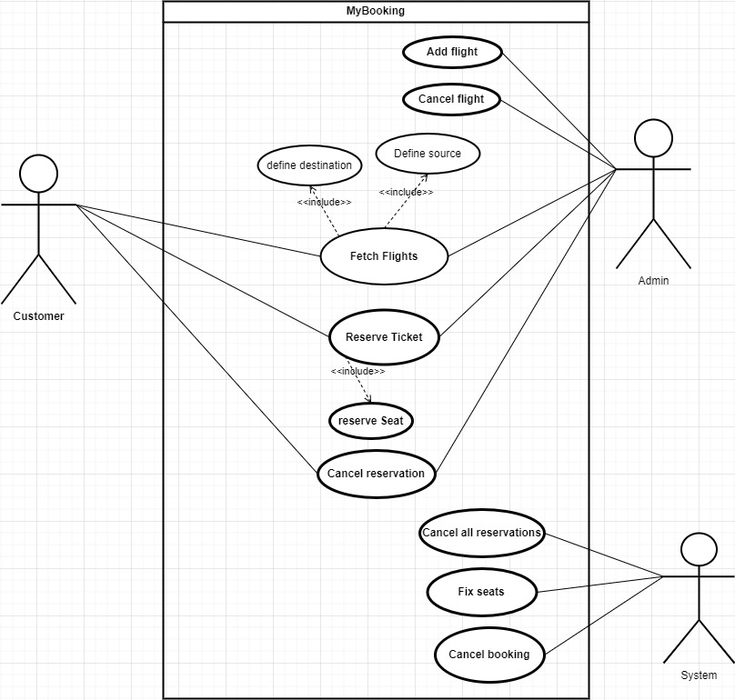
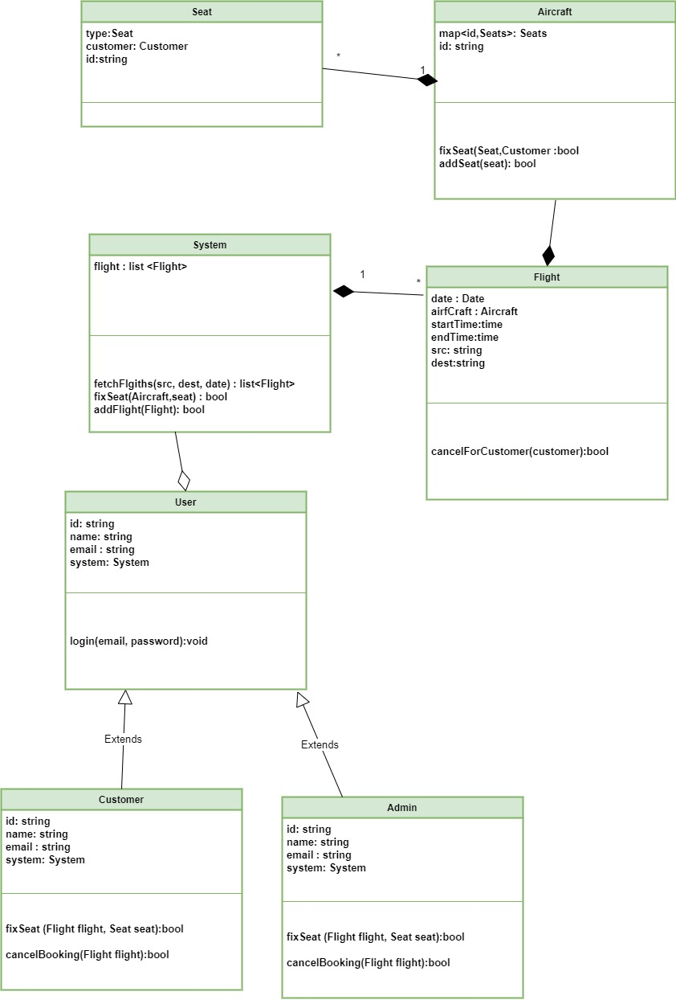

# Booking

## System requirements:

- Customer should be able to fetch flight with it's source and destination.
- customer have the ability to reserve a ticket. 
- customer can cancel reservation.
- system should fix the seats.
- system should fetch all the flights
- system cancel booking.

## Use Case diagram

---

## Class Diagram

