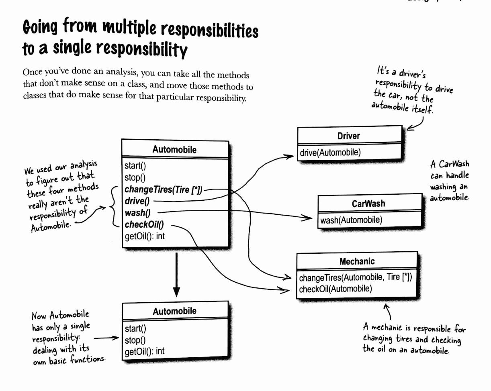
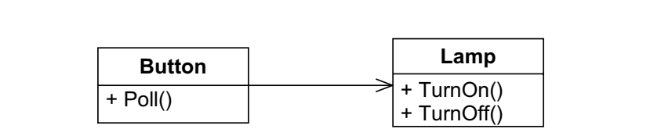
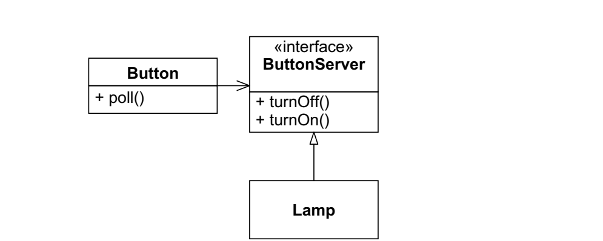
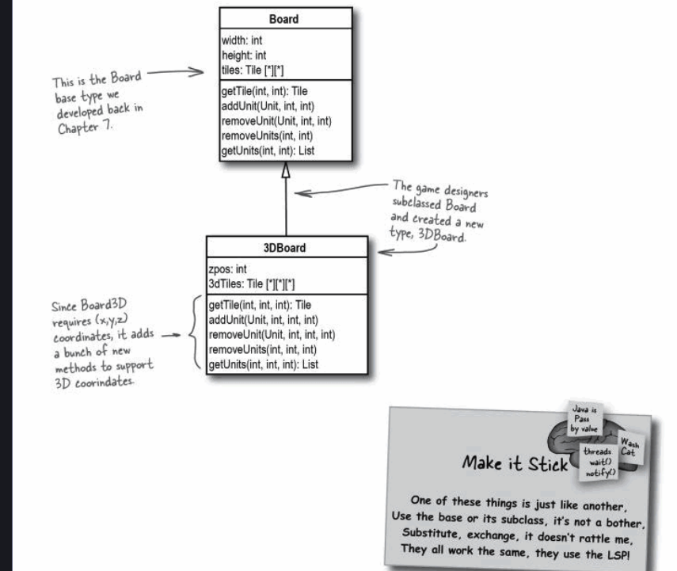
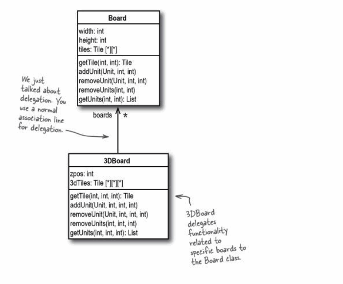
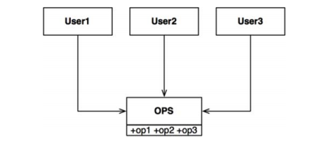
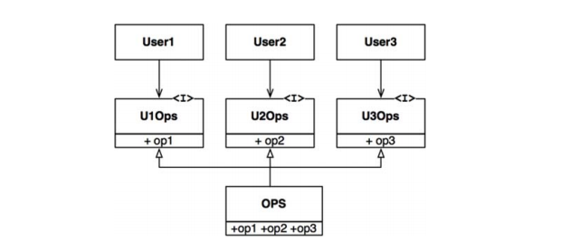

# Solid Principles

## SRP (Single responsibility principle)

- Key when we design -> the module only concern with one and **only one actor**
- if we have just said doesn't make sense , then we are probably violating the srp , for example if we have a function concerned with ceo calculation & coo calculation in the same class , this violates srp as if the ceo want to change they hourly rate calcs , it will also changes for coo's.

### Why?

without it the changing in one actor functionality affect another person functionality

### Example

this figure shoe us how to apply the SRP in the Automobile class by extract all the functions which aren't from the automobile responsibility into separate classes to other actors who has the responsibility to deal with these functionalities & keep the automobile class do it's own functions only.
so when we design a class we have to put in mind it belongs to only one actor who can do it's own work, not involve an any other actors work , in case we notice a function who affect multiple people in the same time , here we must observe it's not act in SRP.

---

## OCP (Open-Closed Principle)

This Principle stands that -> Classes should be opened for extensions , Closed for modifications.

### What does This means ?

this means that , we need our classes keep the same code with no change in the class & it's behavior don't change, but we allow extensions from our own class (The idea base class)

### Why do we need this principle?

for the purpose of good architecture,A good software architecture would reduce the amount of  changed code to
the barest minimum. Ideally, zero. And as a developers when we create a class we have to keep it behave in the same way & do it's own job always , we allow only updating.

**Have you ever seen your operating system behave in different Way?**  

absolutely , not it's only update itself with some new features in some functions like in security system as in windows defender updates , it adds more secure code not change the whole program or it's behavior.

### example

here we use the function match from the class instrumentSpec in both GuitarSpec & MandolinSpec , both classes extends(open for extension) the function from the base class & add their own matching details , and the code in the base class still the same(close for modification)

---

## DIP (Dependency inversion Principle)

a) High-level modules should not depend on low-level modules. Both should depend on **abstractions.**

b)Abstractions should not depend on details. Details should depend on abstractions.

### What does this mean?

this means that to contact with other concerete class
we should access it through a common interface , not directly.

### Why ?

we use that principe to separate our objects from direct contact , to make the dependency on interface which will concern with more objects to do the job , not to make the object control the job of the other object.

to take the advantage of applying multiple objects interact with each other not only 2.

from the backend thinking , when you need to connect to server , you .

### Most Important part ever The Example

In this example we will illustrate better this concept

Here as we see the button object wait for pull functionality from outside affect (We deal with any kind of buttons U can imagine by the way) , when we look at the classes relation , let's see what happened

when U poll the button (pres on it) , it do it's functionality to control whether to turn on or turn off the lamp

> Why is this naive? Consider the Java code that is implied by this model. Note that the Button
class depends directly on the Lamp class. This dependency implies that Button will be affected by changes to
Lamp. Moreover, it will not be possible to reuse Button to control a Motor object. In this design, Button objects
control Lamp objects, and only Lamp objects.

this restricted the button functionalities which can vary more than only control the lamps , so we need to **separate the button from the lamps** to not make the button functions apply only whenever we have a lamp.

so we need to give button a credit to control any device we add not only the lamp .

how  we do it?

The key is interface , let's analyze the pic

we only put the ButtonServer interface which with out we can turn on/ off any device not only the lamp,Lamp implements the ButtonServer interface.
Thus, Lamp is now doing the depending, rather than being depended on.

> By inverting the direction of the dependency and making the Lamp do the depending instead of being
depended on, we have made Lamp depend on a different detail—Button. Or have we?
Lamp certainly depends on ButtonServer, but ButtonServer does not depend on Button. Any kind of
object that knows how to manipulate the ButtonServer interface will be able to control a Lamp. Thus, the depen-
dency is in name only

what we say , we can also other devices than button.

---

## LSP (Liskov's substitution principle)

Subtypes must be substitutable for their base

### What does that mean ?

LSP is all about **well-designed inheritance** when U inherit from base class U must be able to **substitute your subclass for that base class without things going wrong**  otherwise U have inherit incorrectly.

### Why ?

The Goal of this principle is to **basically prevent our old codebase from breaking due to new code.** 
we  will see in our example that using base code will break the new principles for the child guy.

### Example 

in this pic we see the 3DBoard class can't be substituted by it's Board parent , as the 3DBoard class has 3 coordinates (x,y,z) , this violates the LSP. if U look calling any method from the base class on the child doesn't make any sins , and 3DBoard which has 2 coordinates can't be substituted with the board which has only 2d Coordinates , this not a good use for inheritance principle (inheritance & LSP  indicate that any method in the board should be able to be used in 3DBoard with no problems).

let's take a look on how your 3DClass look like after U do this violation 

your 3DBoard class have the ability to call all these functions , it's own & the ones which he derives from his parent, this a mess , in the pic U see the user comment say that he 's confused about which method to pick, you apply a bad inheritance which don't follow it's principle at the end and only add more functions to your child class not modify it to it's behavior.

to solve this problem in better way we use delegation

Briefly -> instead of do inheritance we do the delegation with intialize an object from board inside our 3dBoard , and implement our own functionalties inside 

I refer U to read about **Association** to keep on with these changes , as we also can do composition to solve the problem for more complex problems.

---

## ISP (The Interface Segregation Principle)

simply , don't make multiple users deal with one interface , instead make multi interfaces to deal with multiple users 

### Why?

Clients should not be forced to depend upon interfaces that they do not use

### example 

let's dive into an example 

here, we have 3 users every user only deal with 1 function , 1 with op1, 2 with op2 , 3 with op3 

why the heal you force every user to deal with other users functions.

This dependence means that a change
to the source code of  op2 in OPS will force User1 to be recompiled and
redeployed, even though nothing that it cared about has actually changed.

let's see the right way to do it 

here we make each user to deal with it's own interface only, and separate them from the big interface. 

