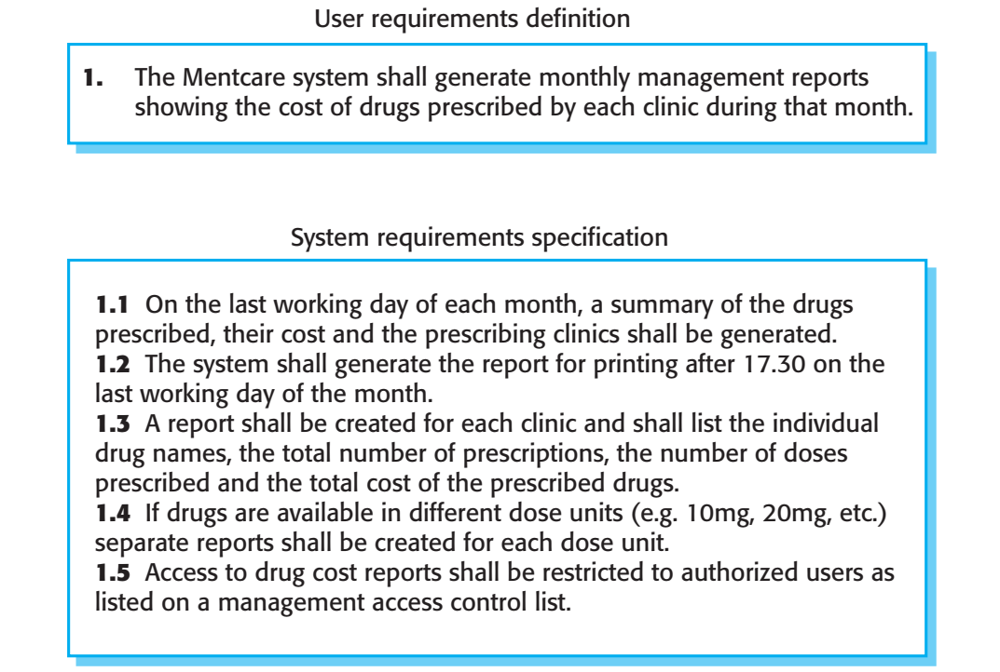
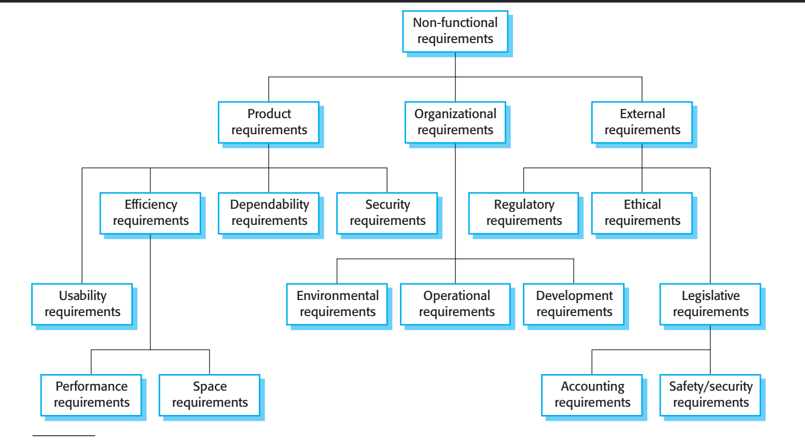
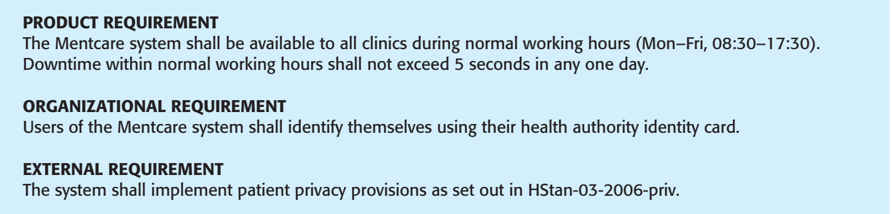

# requirements engineering

The requirements for a system are the descriptions of the services that a system should provide and the constraints on its operation. These requirements reflect the needs of customers for a system that serves a certain purpose such as controlling a device, placing an order, or finding information.

**requirements engineering**->The process of finding out, analyzing, documenting and checking these services and constraints.

## Separation of requirements:

1. User requirements -> in a natural language plus diagrams, of what services the system is expected to provide to system users and the constraints under which it must operate. The user requirements may vary from broad statements of the system features required to detailed, precise descriptions of the system functionality.
2. System requirements ->more detailed descriptions of the software system’s
functions, services, and operational constraints. The system requirements document (sometimes called a functional specification) *should define exactly what is to be implemented.* It may be part of the contract between the system buyer and the software developers.

The readers of the system requirements need to know more precisely what the system will do

## Functional & non-functional requirements 

1. Functional requirements-> These are statements of services the system should provide, how the system should react to particular inputs, and **how the system should behave in particular situations.** In some cases, the functional requirements may also explicitly state **what the system should not do.**

- functional requirements for the Mentcare system, used to maintain information about patients
receiving treatment for mental health problems:

1. A user shall be able to search the appointments lists for all clinics.
2. The system shall generate each day, for each clinic, a list of patients who are
expected to attend appointments that day.
3. Each staff member using the system shall be uniquely identified by his or her
eight-digit employee number.

- Ideally, the functional requirements specification of a system should be both **complete and consistent**. Completeness means that all services and information required by the user should be defined. Consistency means that requirements should not be contradictory.

> In practice, it is only possible to achieve requirements consistency and complete- ness for very small software systems. One reason is that it is easy to make mistakes and omissions when writing specifications for large, complex systems. Another reason is that large systems have many stakeholders, with different backgrounds and expectations. Stakeholders are likely to have different—and often inconsistent—needs. These inconsistencies may not be obvious when the requirements are originally specified, and the inconsistent requirements may only be discovered after deeper analysis or during system development.

2. Non-functional requirements-> These are constraints on the services or functions offered by the system. They include timing constraints, constraints on the development process, and constraints imposed by standards. Non-functional requirements often apply to the system as a whole rather than individual system features or services.

**They may relate to emergent system properties such as reliability,
response time, and memory use. Alternatively, they may define constraints on the system implementation, such as the capabilities of I/O devices or the data representations used in interfaces with other systems.**

> However, failing to meet a non-functional requirement can mean that the whole system is unusable. For example, if an aircraft system does not meet its reliability requirements, it will not be certified as safe for operation; if an embedded control system fails to meet its performance requirements,the control functions will not operate correctly.

-While it is often possible to identify which system components implement specific functional requirements (e.g., there may be formatting components that implement reporting requirements), this is often more difficult with non-functional requirements. The implementation of these requirements may be spread throughout the system, for two reasons:

1. **Non-functional requirements may affect the overall architecture of a system rather than the individual components.** For example, to ensure that performance requirements are met in an embedded system, you may have to organize the system to minimize communications between components.
2. An individual non-functional requirement, such as a security requirement, may generate several, related functional requirements that define new system services that are required if the non-functional requirement is to be implemented.In addition, it may also generate requirements that constrain existing require-
ments; for example, it may limit access to information in the system.

1. Product requirements These requirements specify or constrain the runtime behavior of the software. Examples include performance requirements for how fast the system must execute and how much memory it requires; reliability requirements that set out the acceptable failure rate; security requirements; and usability requirements.
2. Organizational requirements These requirements are broad system requirements derived from policies and procedures in the customer’s and developer’s
organizations. Examples include operational process requirements that define
how the system will be used; development process requirements that **specify the programming language; the development environment or process standards to be used; and environmental requirements that specify the operating environment of the system.**
3. External requirements This broad heading covers all requirements that are derived from factors external to the system and its development process. These may include regulatory requirements that set out what must be done for the system to be approved for use by a regulator, such as a nuclear safety authority; legislative requirements that must be followed to ensure that the system operates within the law; and ethical requirements that ensure that the system will be
acceptable to its users and the general public.

Non-functional requirements often conflict and interact with other functional or non-functional requirements

it causes , also confilctoins between what the customer need & what the developer understand 

> It is difficult to separate functional and non-functional requirements in the requirements document. If the non-functional requirements are stated separately from the functional requirements, the relationships between them may be hard to understand.
