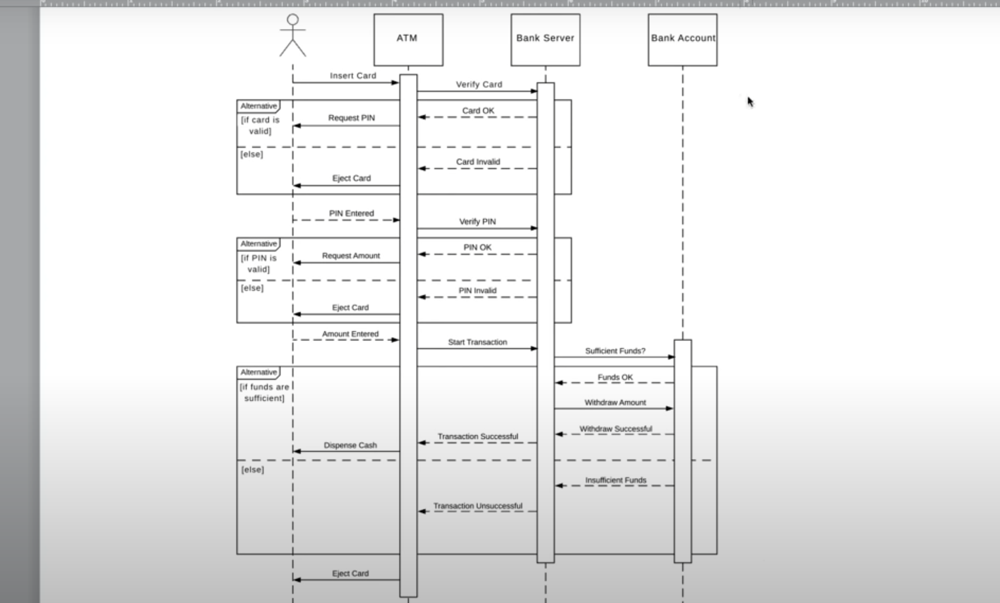

# Sequence Diagram

Sequence diagrams describe interactions among classes in terms of an exchange of messages over time and are used to explore the logic of complex operations, functions or procedures. In this diagram, the sequence of interactions between the objects is represented in a step-by-step manner.

Sequence diagrams show a detailed flow for a specific use case or even just part of a particular use case. They are almost self-explanatory; they show the calls between the different objects in their sequence and can explain, at a detailed level, different calls to various objects.

