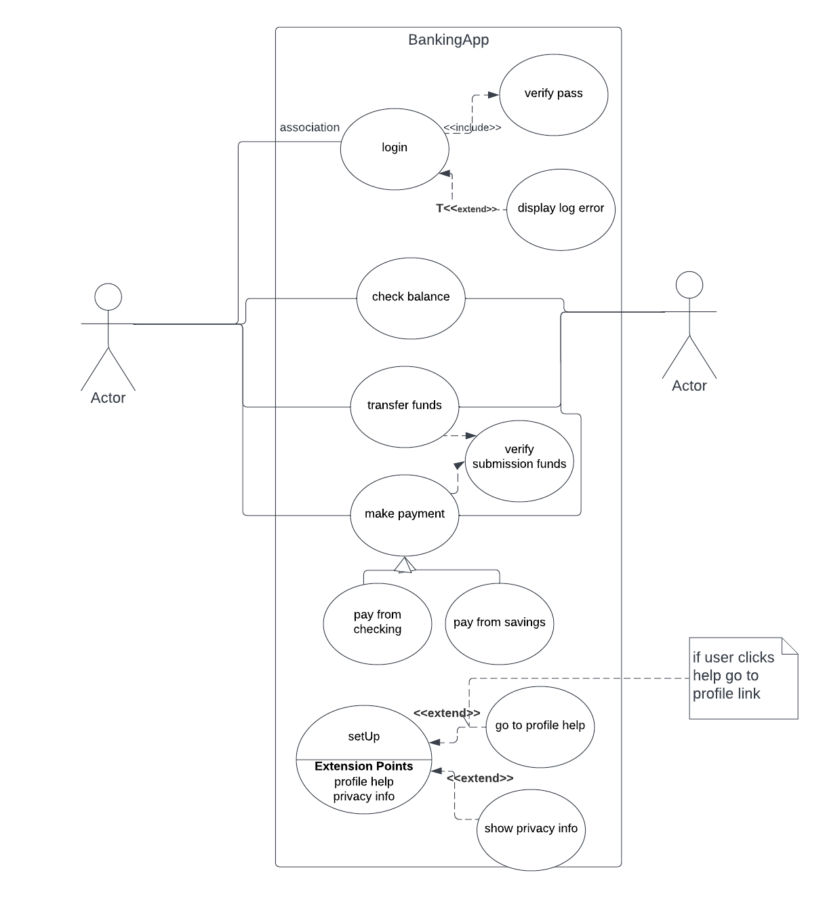

# Use-Case diagram

Use case diagrams describe a set of actions (called use cases) that a system should or can perform in collaboration with one or more external users of the system (called actors). Each use case should provide some observable and valuable result to the actors.

## Why

The primary purpose of the use case diagram is to help development teams visualize the functional requirements of a system, including the relationship of “actors” to the essential processes, as well as the relationships among different use cases.

1. Use Case Diagrams describe the high-level functional behavior of the system.
2. It answers what system does from the user point of view.
3. Use case answers ‘What will the system do?’ and at the same time tells us ‘What will the system NOT do?’.

## Components of the use-case diagram

1. Systems

A system boundary defines the scope and limits of the system. It is shown as a rectangle that spans all use cases of the system.

2. Actor
The users that interact with a system. An actor can be a person, an organization, or an outside system that interacts with your application or system. They must be external objects that produce or consume data.

    - primary -> intiates the use of the system (user)
    - secondary -> Recationary (bank)

3. Use-case 

represents an action that accomplish some sort of task within the system

4. relationships

the relation between the actors & the system
- types

1. Association - > normal interaction between actor & system
2. include -> included use case is based on base use-case (login & verify pass , verify pass can't happen without login).( From a coding perspective, it is like one function being called by another function.)
3. extend -> when the base use case is executed , the extended may or may not happen (display log error & log).()
4. generalization (inheritance)-> U can link it with the user , he maybe a new one or existing one they inherit from the abstract general user 
5. extensions -> interface hahah

## Example 

